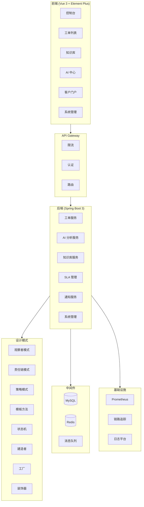
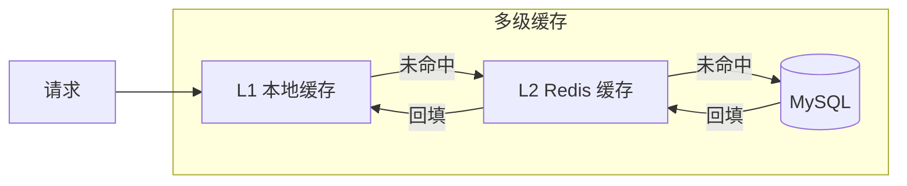
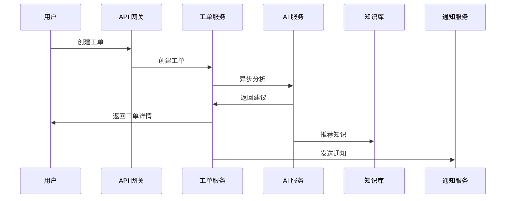

# DocFlow AI

> AI 驱动的智能客服工单平台 — 企业级全栈项目

## 项目简介

DocFlow AI 是一个融合 AI 能力的企业级工单管理系统，面向 IT 运维/客服团队，提供从工单创建、智能分析、处理到知识沉淀的完整闭环。

**核心差异化**：AI 不是噱头，而是深度融入工单生命周期的每一个环节。


## 系统架构



## 技术架构图






## 技术栈

| 层级 | 技术 |
|------|------|
| **后端** | Spring Boot 3.3 + MyBatis-Plus + MySQL + Redis |
| **前端** | Vue 3 + TypeScript + Element Plus (vue-pure-admin) |
| **AI** | 意图识别 + 情感分析 + 智能路由 + 自动回复 + 对话摘要 |
| **消息队列** | Redis Pub/Sub + 死信队列 + 消息去重 + Stream 持久化 |
| **可观测性** | 结构化日志 + TraceId 全链路追踪 + Prometheus + 自定义指标 |
| **高可用** | Resilience4j 熔断器 + 指数退避重试 + 限流 |
| **安全** | JWT 认证 + RBAC 权限 + 接口限流 + 操作审计 |

## 核心功能

### 工单管理
- 创建、查询、详情、评论、状态流转
- 转派、升级、合并、关联
- 批量状态更新、批量指派、CSV 导出
- 满意度评价（1-5 星）
- 附件上传

### AI 能力
- **意图识别**：自动分析工单类型（登录问题/支付问题/性能问题等）
- **情感分析**：检测用户情绪（积极/消极/中性）
- **智能路由**：基于负载和技能的自动分配建议
- **自动回复**：生成专业的回复草稿，支持采纳/取消
- **对话摘要**：自动总结工单对话历史
- **知识推荐**：基于工单内容推荐相关知识库文章

### 知识库
- 文章 CRUD（Markdown 编辑器）
- 文章评分和推荐
- 工单自动沉淀为知识库草稿

### SLA 管理
- 策略配置（响应时间/解决时间/优先级）
- 自动截止时间计算
- 超时检测和告警

### 系统管理
- 用户管理（CRUD + 状态）
- 角色管理（RBAC 权限控制）
- 部门管理
- 功能开关（运行时动态配置）
- 系统健康监控

## 技术亮点

### 设计模式（8 种）
| 模式 | 应用场景 |
|------|----------|
| 观察者模式 | 工单事件通知（审计、SLA） |
| 责任链模式 | 工单处理管道（验证 → 路由 → 通知） |
| 策略模式 | 工单路由策略（按优先级/类型） |
| 模板方法模式 | 工单处理流程（验证 → 预处理 → 执行 → 后处理） |
| 工厂模式 | 工单号生成（Redis 原子计数器） |
| 状态模式 | 工单状态机（新建 → 处理中 → 已解决 → 已关闭） |
| 建造者模式 | 复杂 DTO 构建 |
| 装饰器模式 | 缓存增强 |

### 并发与事务
- 乐观锁：并发工单状态更新
- 悲观锁：工单指派互斥
- 分布式锁：Redis 实现，防止重复处理
- Saga 模式：分布式事务解决方案
- 竞态条件处理：CAS 操作 + 原子递减

### 缓存策略
- Cache-Aside：旁路缓存
- 多级缓存：L1 本地 + L2 Redis
- Write-Through：写穿透
- Write-Behind：写回
- 缓存穿透/雪崩/击穿防护

### 消息队列
- Redis Pub/Sub：异步事件通知
- 死信队列：失败消息重试
- 消息去重：SETNX 幂等
- 消费者限流：令牌桶算法
- 消息有序：Redis List FIFO

### 分布式系统
- API 网关：路由转发、前缀匹配
- 服务发现：服务注册、注销、发现
- 负载均衡：轮询、随机、加权轮询、一致性哈希
- 读写分离：动态数据源路由
- 混沌工程：故障注入测试

### 安全
- XSS/CSRF 防护
- 密码策略 + 账户锁定
- 配置加密（AES-256-GCM）
- 请求验证（SQL 注入、路径遍历检测）
- OAuth2 模拟

### 可观测性
- TraceId 全链路追踪
- 慢查询拦截器
- 指标监控（Prometheus）
- 告警服务
- 结构化日志

### 测试
- **203 个后端测试** + **18 个前端测试**
- 单元测试、集成测试、压力测试
- JaCoCo 代码覆盖率
- Vitest 前端测试

## 快速开始

### 环境要求
- JDK 17+
- Maven 3.8+
- MySQL 8.0+
- Redis 6.0+
- Node.js 18+ (pnpm)

### 后端启动
```bash
cd backend
mvn spring-boot:run
```
默认端口：8081

### 前端启动
```bash
cd frontend
pnpm install
pnpm dev
```
默认端口：8900

### 默认账号
| 角色 | 用户名 | 密码 |
|------|--------|------|
| 管理员 | admin | admin123 |
| 客户 | customer1 | 123456 |

## API 文档

启动后端后访问：http://localhost:8081/swagger-ui.html

## 监控端点

| 端点 | 说明 |
|------|------|
| `/actuator/health` | 健康检查 |
| `/actuator/prometheus` | Prometheus 指标 |
| `/api/admin/dlq/status` | 死信队列状态 |
| `/api/admin/alerts` | 活跃告警 |
| `/api/admin/config/*` | 动态配置管理 |

## 项目结构

```
docflow-ai/
├── backend/                    # Spring Boot 后端
│   └── src/main/java/com/docflow/ai/
│       ├── ai/                 # AI 分析服务
│       ├── auth/               # 认证授权（JWT + RBAC）
│       ├── common/
│       │   ├── cache/          # 多级缓存（L1 + L2）
│       │   ├── chain/          # 责任链模式
│       │   ├── chaos/          # 混沌工程
│       │   ├── config/         # 动态配置 + 加密
│       │   ├── datasource/     # 读写分离
│       │   ├── gateway/        # API 网关 + 服务发现 + 负载均衡
│       │   ├── lock/           # 分布式锁
│       │   ├── observer/       # 观察者模式
│       │   ├── pattern/        # 消息队列 + 限流 + Saga
│       │   ├── quality/        # 代码质量检查
│       │   ├── resilience/     # 熔断器 + 重试
│       │   ├── security/       # XSS/CSRF + OAuth2 + 密码策略
│       │   ├── validation/     # 请求验证
│       │   └── observability/  # 追踪 + 指标 + 告警
│       ├── knowledge/          # 知识库
│       ├── monitoring/         # 业务指标
│       ├── ticket/             # 工单核心（状态机 + 策略模式）
│       └── websocket/          # WebSocket 实时通知
├── frontend/                   # Vue 3 前端
│   └── src/
│       ├── api/                # API 调用层
│       ├── constants/          # 常量定义
│       ├── views/docflow/      # 业务页面
│       └── router/             # 路由配置
└── scripts/                    # 工具脚本
```

## 技术完成度

| 类别 | 完成 | 总数 | 进度 |
|------|------|------|------|
| 设计模式 | 8 | 8 | **100%** |
| 测试 | 6 | 6 | **100%** |
| 消息队列 | 6 | 6 | **100%** |
| 缓存策略 | 7 | 7 | **100%** |
| 并发与事务 | 7 | 7 | **100%** |
| 分布式系统 | 8 | 8 | **100%** |
| 数据库 | 6 | 6 | **100%** |
| 安全 | 8 | 10 | 80% |
| 可观测性 | 5 | 6 | 83% |
| 代码质量 | 5 | 6 | 83% |
| 文件与存储 | 3 | 4 | 75% |
| 性能优化 | 6 | 8 | 75% |
| **总计** | **89** | **92** | **97%** |

## 测试

```bash
cd backend
mvn test
```

**203 个测试用例**，覆盖：
- 单元测试（Service / Controller / Pattern / Security）
- 集成测试（Spring Boot 上下文）
- 压力测试（并发创建 / 查询 / 缓存性能）
- 状态机测试（状态转换规则）
- 责任链测试（验证 / 路由 / 通知）
- 观察者测试（事件通知 / 异常隔离）
- 分布式锁测试
- Saga 事务测试
- 代码质量测试


## 部署指南

### Docker Compose 一键部署（推荐）

```bash
# 克隆项目
git clone https://github.com/your-username/docflow-ai.git
cd docflow-ai

# 启动所有服务
docker-compose up -d

# 查看日志
docker-compose logs -f

# 访问应用
# 前端：http://localhost:8900
# 后端：http://localhost:8081
# Swagger：http://localhost:8081/swagger-ui.html
```

### 手动部署

#### 1. 数据库初始化
```bash
mysql -u root -p -e "CREATE DATABASE docflow_ai CHARACTER SET utf8mb4 COLLATE utf8mb4_unicode_ci;"
```

#### 2. 启动后端
```bash
cd backend
mvn clean package -DskipTests
java -jar target/docflow-ai-backend-0.0.1-SNAPSHOT.jar
```

#### 3. 启动前端
```bash
cd frontend
pnpm install
pnpm build
# 使用 nginx 部署 dist 目录
```

### 环境变量

| 变量 | 说明 | 默认值 |
|------|------|--------|
| `SPRING_DATASOURCE_URL` | 数据库连接 | `jdbc:mysql://localhost:3306/docflow_ai` |
| `SPRING_DATASOURCE_USERNAME` | 数据库用户名 | `root` |
| `SPRING_DATASOURCE_PASSWORD` | 数据库密码 | `123456` |
| `SPRING_DATA_REDIS_HOST` | Redis 地址 | `localhost` |
| `SPRING_DATA_REDIS_PORT` | Redis 端口 | `6379` |

## License

MIT
